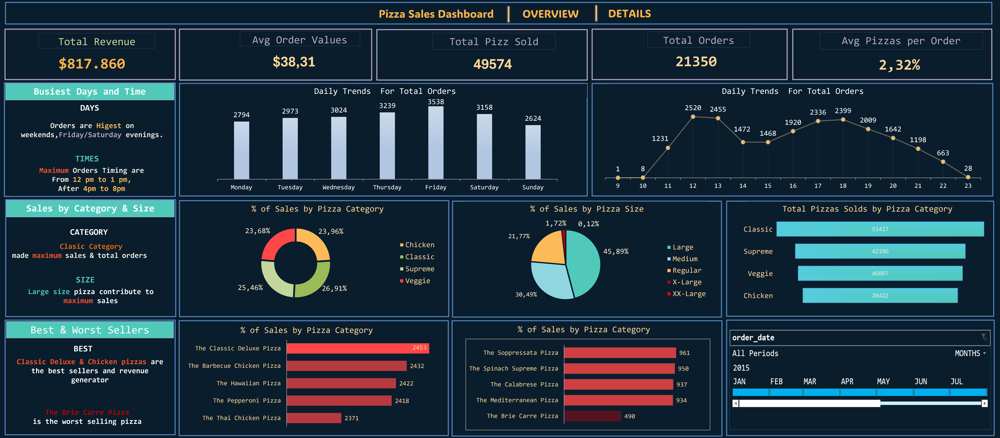

# 🍕 Pizza Sales Dashboard (Excel)

An interactive Excel dashboard to analyze pizza sales performance using advanced Excel techniques such as Power Query, Pivot Tables, Data Modeling, and Data Visualization.

## 📊 Dashboard Preview

## 📁 Project Structure

- `excel_dashboard/`: Contains the Excel file with the full interactive dashboard.
- `data/`: Sample dataset used for analysis.
- `assets/`: Contains dashboard screenshots.
- `README.md`: Project documentation.

## 🧩 Features

- Total Revenue, Average Order Value, and Orders Overview
- Sales Breakdown by Category and Size
- Busiest Days and Peak Hours
- Best and Worst Selling Pizzas
- Daily Trends Visualization
- Interactive Time Filter

## 📌 Tools Used

- Microsoft Excel
  - Power Query
  - Pivot Tables
  - Slicers & Timelines
  - Conditional Formatting & Charts

## 📎 Insights Gained

- Most revenue generated on weekends, especially Friday evenings.
- Classic and Large size pizzas contribute the most to sales.
- The Classic Deluxe Pizza is the top seller, while the Brie Carre Pizza is the least sold.

## 🚀 How to Use

1. Download the Excel file from the `excel_dashboard/` folder.
2. Open with Excel (2016+ recommended for full compatibility).
3. Interact with slicers and timeline to explore data dynamically.

## 📃 License

This project is licensed under the MIT License.
